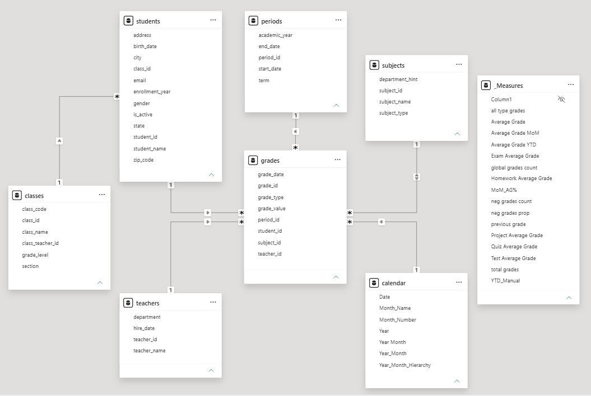
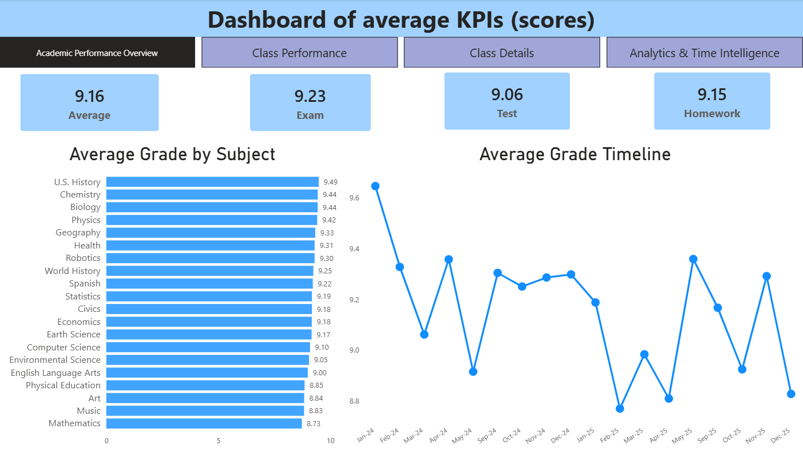
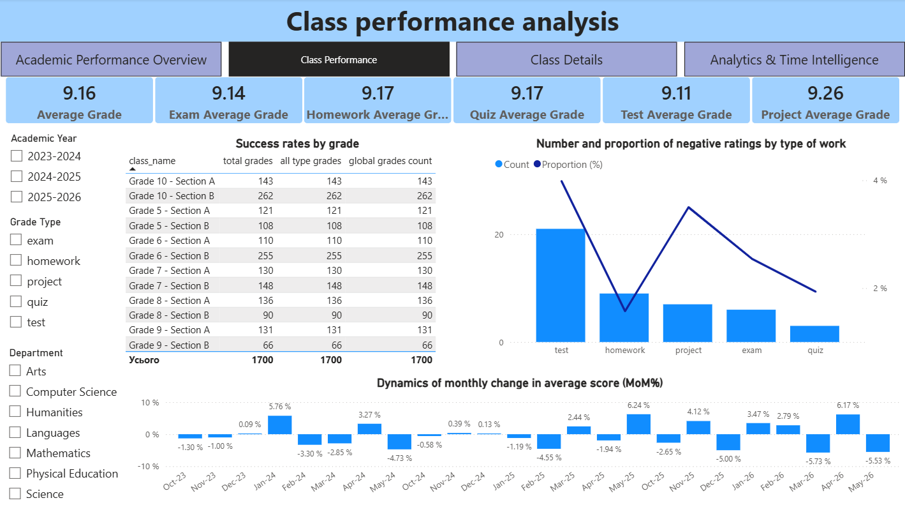
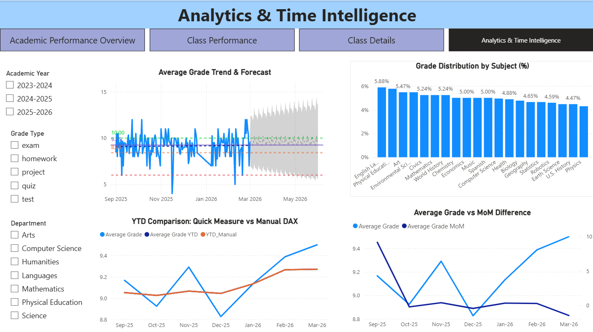
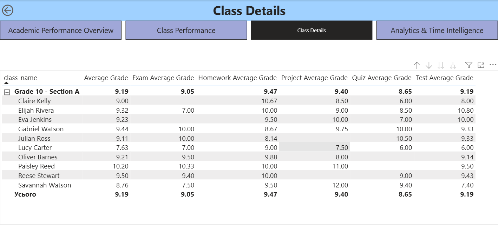
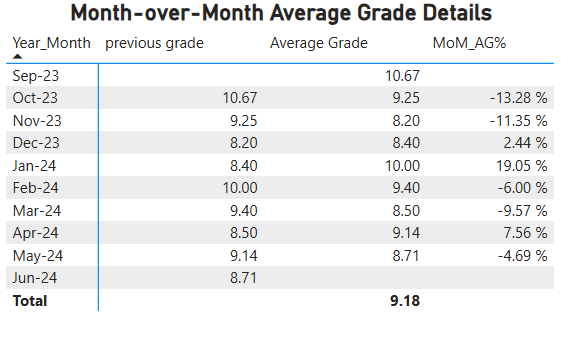

# 🎓 Student Performance & Academic Intelligence Platform

[](student_performance_analytics.pbix)
[](dax/)
[](LICENSE)

## 📌 Executive Summary
This project delivers an end-to-end **Academic Performance & Student Intelligence System** in **Power BI**, designed to provide educational leadership with centralized visibility into academic metrics, cohort trends, grading anomalies, and long-term trajectory forecasts. By transforming raw multidimensional academic logs through **Power Query** into an optimized **Star Schema**, this solution enables granular drill-down analysis from district/school-level aggregates to individual student records.

---

## 🎯 Business Problem
* **Performance Volatility**: How do student average scores fluctuate month-over-month (MoM%), and which academic terms exhibit sharp performance drops?
* **Risk Identification**: Which specific subjects and assessment types (e.g., Exams vs. Tests vs. Homework) generate the highest proportion of negative ratings?
* **Actionable Granularity**: How can administrators seamlessly transition from high-level departmental KPIs down to student-specific assignment records to take timely interventions?

---

## 🛠 Tech Stack & Architecture
* **Power BI Desktop**: Multi-page report design, drill-through workflows, custom tooltips, cross-filtering, built-in time series forecasting.
* **Data Modeling & Power Query**: Star Schema architecture (1 Fact, 6 Dimensions), surrogate keys, strict `1:*` single-direction relationships, data normalization.
* **DAX (Data Analysis Expressions)**: Dynamic KPI measures, filter context manipulation (`CALCULATE`, `ALL`), Time Intelligence calculations (`DATESYTD`, `DATEADD`, MoM% shifts).

---

## 🔍 Key Findings & Analytical Insights

| Analytical Dimension | High-Performance Benchmark | Critical Risk / Volatility Area | Strategic Takeaway |
| :--- | :---: | :---: | :--- |
| **Subject Breakdown** | **U.S. History (9.49)**, **Chemistry (9.44)** | **Mathematics (8.73)**, **Music (8.83)** | STEM subjects show wide dispersion; Math requires structural curriculum adjustments. |
| **Assessment Dynamics** | **Projects (9.80 Avg)** | **Exams & Tests (~8.94–9.06 Avg)** | Higher failure rates concentrate in formal testing vs. coursework assignments. |
| **Time Dynamics (MoM)** | **Jan–Feb Recoveries (+19.05%)** | **Quarterly Dips (-13.28% to -17.19%)** | Pronounced cyclical score drops occur prior to term examinations. |

* **Predictive Performance Trajectory**: Integrated time-series forecasting projects stable baseline scores around ~9.0–9.2 with a narrow 95% confidence interval across upcoming academic periods.
* **Assessment Imbalance**: The proportion of negative marks is overwhelmingly driven by written tests and formal exams, while project-based assessments consistently maintain top average scores (9.80).
* **Targeted Intervention**: Granular drill-through matrices immediately surface students with sub-7.0 scores in specific classes without losing macro context.

---

## 💡 Strategic Recommendations
1. **Curriculum & Support Optimization**: Allocate focused tutoring hours to lower-performing disciplines (Mathematics and Physical Sciences) to flatten cross-subject disparities.
2. **Pre-Exam Intervention Loops**: Deploy targeted review sessions prior to months exhibiting historical MoM score collapses (-13% to -17%).
3. **Assessment Standardization**: Calibrate the evaluation criteria across homework, project work, and formal examinations to reduce score variance.

---

## 🏗️ Data Model Architecture

The data model follows a strict **Star Schema** with a centralized fact table connected to 6 normalized dimensions and a decoupled `_Measures` table.



---

## ⚙️ Core DAX Formulations

### 1. Month-over-Month Grade Variance (MoM%)
```dax
Average Grade MoM% = 
VAR PreviousMonthGrade = 
    CALCULATE(
        [Average Grade],
        DATEADD('calendar'[Date], -1, MONTH)
    )
RETURN
    DIVIDE([Average Grade] - PreviousMonthGrade, PreviousMonthGrade, 0)
```

### 2. Year-to-Date (YTD) Performance Tracking
```dax
Average Grade YTD = 
CALCULATE(
    [Average Grade],
    DATESYTD('calendar'[Date])
)
```

### 3. Unfiltered Global Baseline Count
```dax
Global Grades Count = 
CALCULATE(
    COUNTROWS('grades'),
    ALL('grades')
)
```

---

## 📊 Project Structure & Deliverables

```
Student-Performance-Academic-Intelligence-PowerBI/
├── LICENSE
├── README.md
├── student_performance_analytics.pbix
├── dax/
│   └── measures_definitions.dax
└── images/
    ├── 01_data_model_star_schema.png
    ├── 02_academic_performance_overview.png
    ├── 03_class_performance_analysis.png
    ├── 04_class_details_drillthrough.png
    ├── 05_analytics_time_intelligence.png
    └── 06_mom_grade_details.png
```

* 📄 **DAX Repository**: [`dax/measures_definitions.dax`](dax/measures_definitions.dax) — complete list of business logic, KPI cards, and Time Intelligence measures
* 📊 **Power BI Model File**: [`student_performance_analytics.pbix`](student_performance_analytics.pbix) — interactive report file

---

## 📈 Visualizations

### Executive Academic Performance Overview


### Class Performance & Negative Assessment Analysis


### Analytics, Forecasting & Time Intelligence


### Granular Class Details (Drill-Through Target)


### Month-over-Month Detailed Metrics


---

## ✉️ Contact

**Author:** Oleksandr Hordashevskyi

- LinkedIn: [Oleksandr Hordashevskyi](https://www.linkedin.com/in/o-hordashevskyi/)
- Email: [o.hordashevskyi@gmail.com](mailto:o.hordashevskyi@gmail.com)
